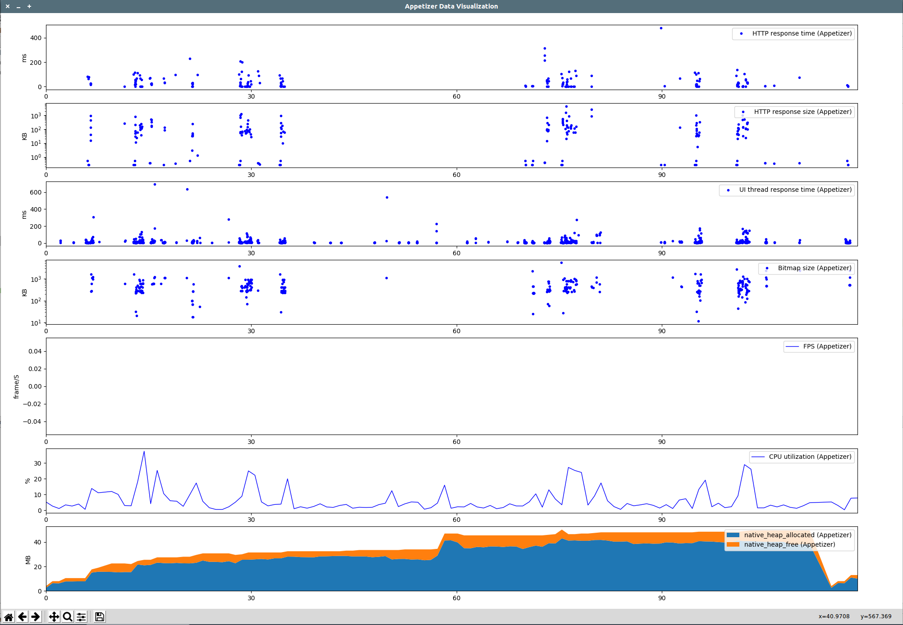

# insights.py [](https://travis-ci.org/appetizerio/insights.py) 
Appetizer 质量监控的 Python 客户端

使用流程
* 将待测试的 apk 上传到服务端进行插桩
* 下载插桩后的 apk
* 安装插桩后的应用，进行测试流程（自动化测试，人工测试都可以），log会存在手机本地
* 上传 log 至服务端进行分析，获取报告
  * 可以通过APP端浮动功能框进行上传
  * 可以通过PC端上传USB连接的设备的log
  * 可以通过本脚本控制上传
* 通过[Appetizer Desktop](https://appetizer.io) >= 1.3.0进行可视化查看报告

插桩和分析包括
* 应用崩溃（Crash）的原因和崩溃时的状态
* 所有线程抛出的异常（即使不会造成崩溃）
* 应用未响应（ANR）的状态
* HTTP 请求以及回复的详细信息，包含以下库的API (更多库支持正在添加)
    - [okhttp >=2.2 或 okhttp3](https://github.com/square/okhttp/wiki/Interceptors#availability)
    - [retrofit >1.8（基于okhttp的）](https://github.com/square/okhttp/wiki/Interceptors#availability)
    - apache http
    - urlconnection
    - volley
* 主线程卡顿（图片问题，回调问题等）
* 界面切换耗时
* CPU 占用率和 heap 占用大小
* FPS
* 内存指标PSS等


## 环境要求
* Python 2.7.x 3.3+
* node >= 0.10.4
* adb已经安装并已经添加到环境变量PATH中
* 支持Windows, MacOS, Linux
* APK文件名尽量用英文，APP本身状态、字符串等可以有中文

## 用法
### 安装依赖
``` Shell
python -m pip install -r requirements.txt
```
### 帮助
``` Shell
python insights.py -h
```
确认不会有错误即依赖安装正确

### login: 登录账号
``` Shell
python insights.py login username password
```
所有客户端操作均需要登录认证，执行登录后登录用token保存在当前 `.access_token` 文件。token默认60天有效，使用任意操作会自动续期。60天后token过期需要重新登录。

账号可在 [Appetizer.io](https://api.appetizer.io/user/register) 注册。

### 插桩 apk
``` Shell
python insights.py process apk processed_apk
```

例如
``` Shell
python insights.py process my.apk my_processed.apk 
```

插桩需要上传、处理、下载，需要一定时间，依据网络情况与APK大小不同大致在1分钟-3分钟内，期间会有输出表示进展情况。

### 安装插桩后的APK并授权

``` Shell
python insights.py install my_processed.apk -s serialno1 -s serialno2
```
* `my_processed.apk` 是插桩后的apk
* `-s`是可选参数， `serialno1` `serialno2` 之类的是设备的串号，通过 `adb devices` 获得，需要安装到多个设备可以用多个`-s`命令指定设备; 不提供任何`-s`命令时，默认认为只有一个设备并对该设备进行安装
* 安装后会自动授权log （小米无法自动化授权，建议在安装完成后授权读写SDCARD）


### 测试
Appetizer 质量监控客户端对测试没有特别限制，可以是简单的人工测试，也可以是复杂的回归测试，测试长度不限。插桩后的APK会自动log

### 上传log获取分析报告
``` Shell
python insights.py analyze my_processed.apk -s serialno1 -s serialno2 --clear
```
* `-s`是可选参数， `serialno1` `serialno2` 之类的是设备的串号，通过 `adb devices` 获得，需要分析多个设备上的log可以用多个`-s`命令指定设备; 不提供任何`-s`命令时，默认认为只有一个设备并对该设备进行分析
* `--clear`是可选参数，用于从设备下载log后将设备上log清空
* 分析成功后可以通过[Appetizer Desktop](https://appetizer.io) >= 1.3.0 查看
* 分析成功后，服务器会返回相应的报告和导出格式的下载路径，例如：
``` Shell
waiting...... server is uploading the report
server has generated and uploaded the report
download report data at:
http://cache.appetizer.io/xxxxx.report.gz
exported reports available at (deprecated, use Appetizer Desktop instead):
{
    "csv": "http://cache.appetizer.io/xxxxx.csv.zip",
    "json": "http://cache.appetizer.io/xxxxx.json.zip",
    "html": "http://cache.appetizer.io/xxxxx.html.zip",
}
```
下载的报告格式为gzip，解压后是一个json，详细报告格式参考：http://doc.appetizer.io/advanced/under-the-hood-analysis.html

### 使用报告可视化工具
* 首先安装可视化工具所需要的依赖：
```bash
pip install -r requirements.report.txt
```
* 可视化报告
```
python report.py sample-report.json.gz
```
可以传入gz文件或者json文件，可视化效果如下（底部有matplotlib标准工具栏可以对区域进行缩放等）：


### 其他功能
``` Shell
python insights.py clearlog my_processed.apk -s serialno1 -s serialno2 --clear
```
将设备上有指定插桩后的APK的log清除
